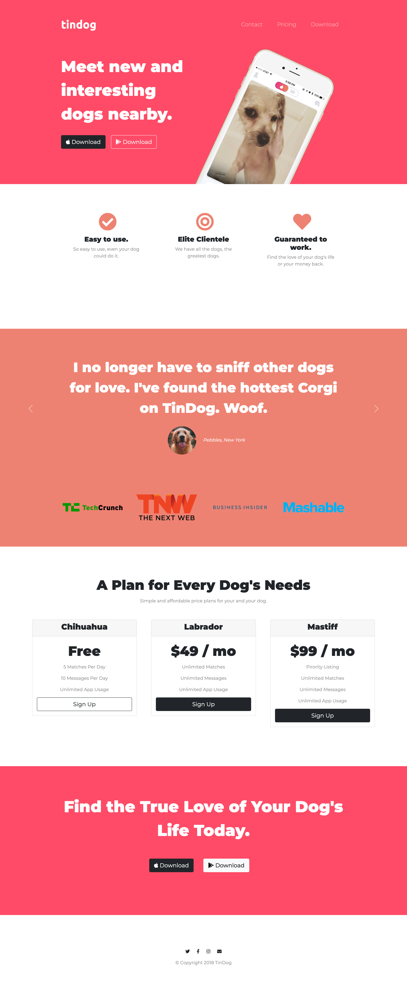
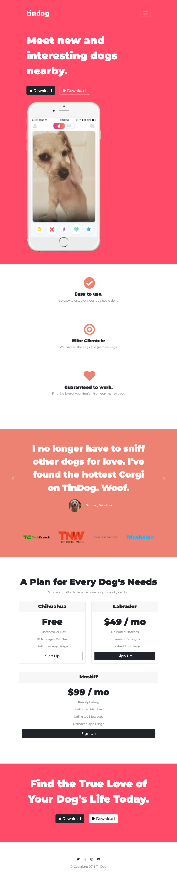

# Udemy Course - TinDog Project

## Table of contents

- [Overview](#overview)
  - [Screenshot](#screenshot)
  - [Links](#links)
- [My process](#my-process)
  - [Built with](#built-with)
- [Author](#author)

## Overview

### Screenshot

### Links

- [Soultion URL](https://github.com/AOA19/tindog)
- [Live Site URL](https://aoa19.github.io/tindog/)

## My process

### Built with

- Semantic HTML5 markup
- CSS3
- Bootstrap 
- Mobile-first workflow

## Author

- Github: [@AOA19](https://github.com/AOA19)

